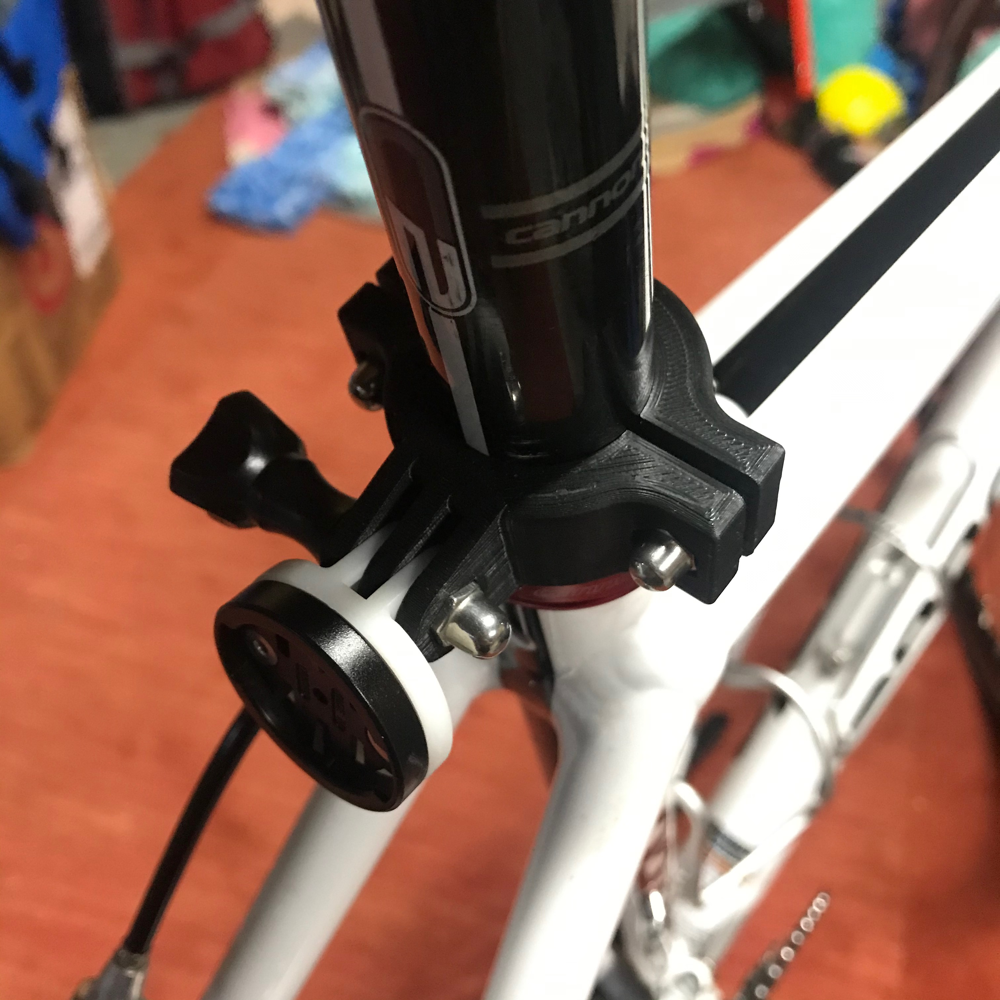

# 27.2mm Seat Post GoPro Mount

This is a road bike 27.2mm seat post mount for GoPro and compatible devices.

Designed to be mounted with stainless steel M5x15mm button head Allen key screws (often used to mount water bottle cages) and stainless steel m5 cap nuts. Similar M5x20mm screw and cap nut could be used for the GoPro mount.

On Thingiverse: https://www.thingiverse.com/thing:4604283

